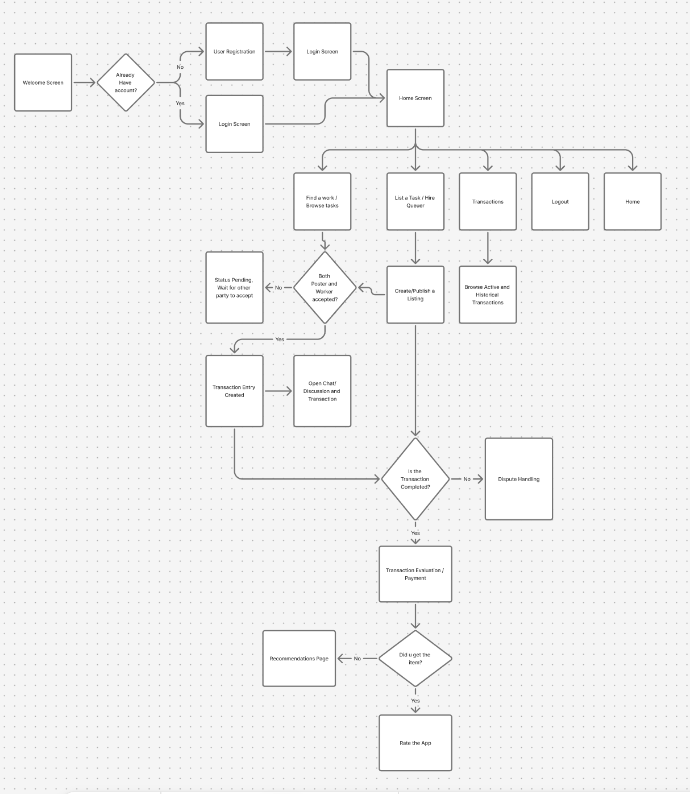

# Flow
- figma link (https://www.figma.com/board/niqFscm4NtcSxvVc5S9WBU/Untitled?node-id=0-1&t=IJx6MhIAzLn5SmoP-1)

# To Test 
## (This assumes you have basic python installed and venv)
- Note: install the required packages in your venv such as streamlit (e.g. pip install streamlit)
- Note: use an IDE (pycharm) for better experience

`streamlit run main.py`

# Full Description, Features and Limitations
- these information are submitted in a separate document